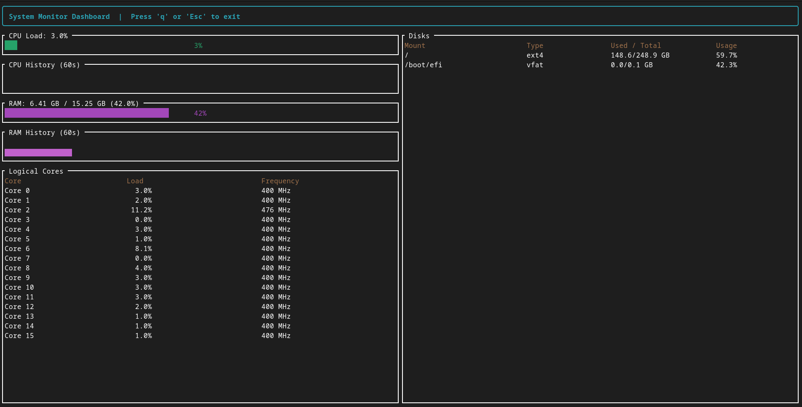

# System Monitor Dashboard

A real-time terminal system monitor built in Rust using [Ratatui](https://ratatui.rs/) for rendering, [sysinfo](https://crates.io/crates/sysinfo) for system metrics, and [crossterm](https://crates.io/crates/crossterm) for terminal input/output handling.



## Features

- **CPU Load** — Live overall CPU usage gauge, updated every second.
- **CPU History** — Rolling 60-second sparkline graph of CPU usage.
- **RAM Usage** — Live memory usage gauge showing used / total GB and percentage.
- **RAM History** — Rolling 60-second sparkline graph of memory usage.
- **Per-Core Table** — Load and clock frequency for each logical CPU core.
- **Disk Usage** — Mount point, filesystem type, used/total space, and usage percentage for all detected disks.
- **Responsive TUI Layout** — Two-column layout (metrics on the left, disks on the right) that adapts to terminal size.

## Requirements

- [Rust](https://www.rust-lang.org/tools/install) (stable toolchain, 2021 edition or later)
- A terminal that supports ANSI escape codes (most modern terminals do)

## Dependencies

| Crate      | Purpose                                  |
|------------|-------------------------------------------|
| `ratatui`  | Terminal UI rendering (widgets, layout)   |
| `crossterm`| Cross-platform terminal input/events      |
| `sysinfo`  | CPU, memory, and disk metrics             |

## Installation

Clone the repository and build with Cargo:

```bash
git clone https://github.com/YounassAg/System-monitor.git
cd system_monitor
cargo build --release
```

## Usage

Run the dashboard from the project directory:

```bash
cargo run --release
```

Or run the compiled binary directly:

```bash
./target/release/system-monitor
```

### Controls

| Key            | Action        |
|----------------|---------------|
| `q` or `Esc`   | Quit the app  |

## How It Works

The app polls `sysinfo` for fresh CPU, memory, and disk data once per second (`tick_rate`). Each tick, the CPU and RAM usage values are pushed into a 60-entry sliding-window history buffer, which powers the sparkline graphs. Between ticks, the event loop listens for keyboard input (with a timeout matching the remaining tick interval) so the UI stays responsive without busy-waiting.

Rendering is handled entirely by Ratatui:
- The screen is split into a header, body, and footer.
- The body is split into a left column (CPU/RAM gauges, history graphs, and a per-core table) and a right column (disk table).

## Project Structure

```
.
├── src/
│   └── main.rs      # App state, update loop, and UI rendering
├── Cargo.toml
└── README.md
```
